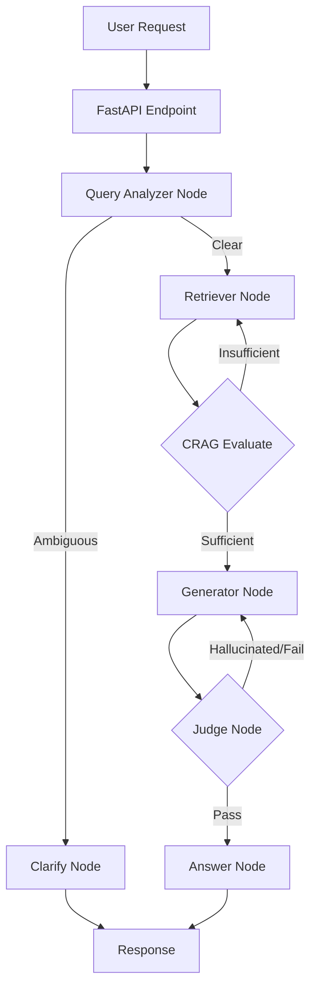

# Vietnamese Legal Compliance Agent

## 📖 Project Overview
The **Vietnamese Legal Compliance Agent** is an advanced AI-powered assistant designed to streamline the complex process of researching and interpreting Vietnamese legal documents. Leveraging a sophisticated Retrieval-Augmented Generation (RAG) architecture with hybrid search capabilities, it accurately ingests, indexes, and retrieves precise legal clauses from raw PDF files. By eliminating the manual, time-consuming effort of navigating dense legal texts, this system empowers businesses and legal professionals to achieve rapid, reliable, and source-cited compliance insights.

## 🧠 Architecture & Agentic Workflow
The system utilizes a state-of-the-art **Agentic Workflow** built on top of LangGraph. It incorporates self-correction loops (CRAG & Self-Reflection) to ensure all legal answers are accurate, properly cited, and hallucination-free.



## 🛠️ Technology Stack
*   **Backend & API**: FastAPI, Uvicorn, Python
*   **AI & Orchestration**: LangGraph, Groq API (Llama 3), Sentence-Transformers (Local Embeddings)
*   **Search & NLP**: Qdrant (Vector Database), Rank-BM25 (Sparse/Lexical Search), Underthesea (Vietnamese NLP Toolkit)
*   **Data & Memory**: PostgreSQL (Metadata & Chunks Storage), Redis (Multi-turn Chat Memory)
*   **Infrastructure**: Docker & Docker Compose (Containerization)

## ✨ Key Features
*   **Advanced Agentic Workflow (LangGraph)**: Implements complex reasoning paths, including query analysis, corrective retrieval (CRAG), and self-reflection. If a retrieved context is insufficient or a generated answer hallucinates facts, the agent iteratively loops and corrects itself before responding.
*   **Robust Hybrid Search System**: Combines exact keyword matching (BM25 with Vietnamese-specific tokenization via Underthesea) and semantic search (Qdrant Vector DB). This setup supports highly accurate queries, significantly reducing false positives in the dense legal domain.
*   **Metadata-Aware Filtering**: Employs Qdrant's payload capabilities to filter vectors by legal document numbers (`so_hieu`), ensuring the retriever strictly fetches clauses from the exact legal text requested by the user.
*   **Multi-Turn Contextual Memory**: Integrates Redis to securely store and retrieve sliding-window chat histories. The agent accurately remembers prior interactions, enabling fluid and continuous conversations.
*   **Automated Data Ingestion Pipeline**: Features an asynchronous background task that parses complex Vietnamese PDF layouts, automatically extracts crucial metadata (Title, Document Number, Date), segments text by legal articles (Điều), and synchronously populates PostgreSQL, BM25 Index, and Qdrant.

## 🚀 Getting Started (Local Development)

### Prerequisites
*   [Docker](https://www.docker.com/) & Docker Compose
*   [Python 3.10+](https://www.python.org/)
*   A [Groq API Key](https://console.groq.com/)

### 1. Clone & Environment Setup
```bash
git clone https://github.com/quocthaj/vietnamese-legal-compliance.git
cd vietnamese-legal-compliance

# Create .env file and add your GROQ_API_KEY
cp .env.example .env
```

### 2. Start Infrastructure Services
Start the PostgreSQL, Qdrant, and Redis containers in the background:
```bash
docker compose up -d
```

### 3. Install Python Dependencies
```bash
# Create and activate a virtual environment (Windows example)
python -m venv agent-legal
agent-legal\Scripts\activate

# On macOS/Linux use: source agent-legal/bin/activate

# Install required packages
pip install -r requirements.txt
```

### 4. Database Initialization & Data Ingestion
Set up the initial SQL schema and process existing PDFs located in the `data/` directory:
```bash
# Initialize PostgreSQL tables
python ingestion/init_db.py

# Parse PDFs, embed text, and build BM25 Index
python ingestion/pdf_parser.py
python ingestion/embedder.py
python ingestion/bm25_indexer.py
```

### 5. Run the Application
Start the FastAPI application:
```bash
python api/main.py
```
The API will be available at `http://localhost:8000`. You can test the endpoints directly via the interactive Swagger documentation at `http://localhost:8000/docs`.
